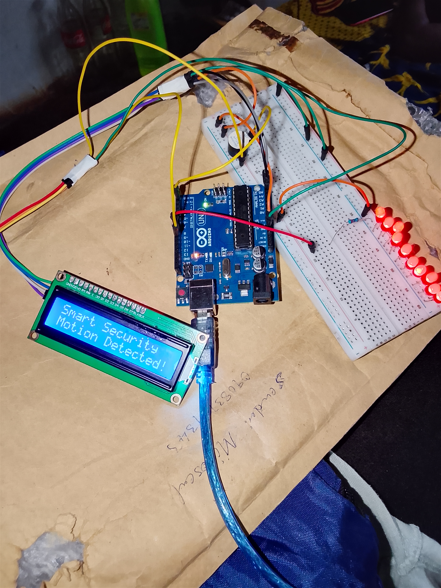

# Smart Security System

## Overview
The Smart Security System is an Arduino-based project designed to detect human motion using a PIR motion sensor. Once motion is detected, the system activates an LED indicator, triggers a buzzer alarm, and displays a warning message on an I2C LCD screen.

This project is suitable for beginners learning embedded systems, Arduino programming, sensors, and basic home automation/security concepts.

---

## Features
- Motion detection using PIR sensor
- LED visual alert system
- Buzzer alarm notification
- 16x2 I2C LCD display messages
- Real-time security status updates
- Simple and beginner-friendly Arduino project

---

## Components Used
- Arduino UNO
- PIR Motion Sensor
- 16x2 I2C LCD Display
- Buzzer
- LED
- Jumper Wires
- Breadboard

---

## How It Works
1. The system initializes the LCD display and sensors.
2. The PIR sensor continuously monitors movement.
3. When motion is detected:
   - The LCD displays "Motion Detected"
   - The LED turns ON
   - The buzzer alarm sounds repeatedly
4. When no motion is detected:
   - The LCD displays "No Motion"
   - The system returns to monitoring mode

---

## Circuit Connections

### PIR Sensor
- VCC → 5V
- GND → GND
- OUT → Digital Pin 10

### LED
- Positive → Digital Pin 8
- Negative → GND (through resistor)

### Buzzer
- Positive → Digital Pin 2
- Negative → GND

### I2C LCD
- VCC → 5V
- GND → GND
- SDA → A4
- SCL → A5

## Project Image

[Check here for other Images](images)

---
## Project Code
[Click Here for the code](code/motion_alarm_system_project_on_friday_15th_may_2026.ino)

---
## Project Demostration Video
[Click here to check out the video](https://youtu.be/ba1OPfzNIE0?si=RAjKw2qpEk4jxtDu)

## Applications
- Home security systems
- Room monitoring
- Motion alert systems
- Beginner embedded systems projects
- Smart automation projects

---

## Future Improvements
- GSM alert notifications
- Mobile app integration
- Camera support
- Password security system
- IoT monitoring dashboard

## Author
Moses Kolawole

---

## License
This project is open-source and available for educational purposes.
